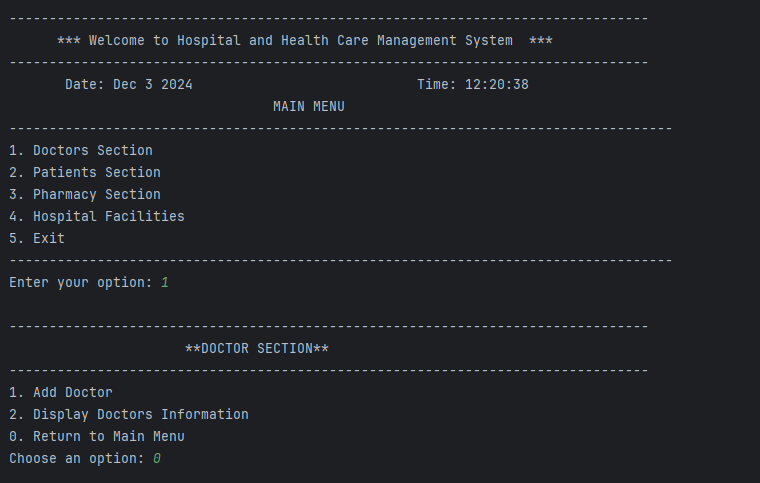
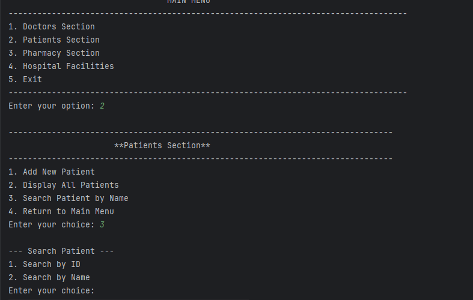
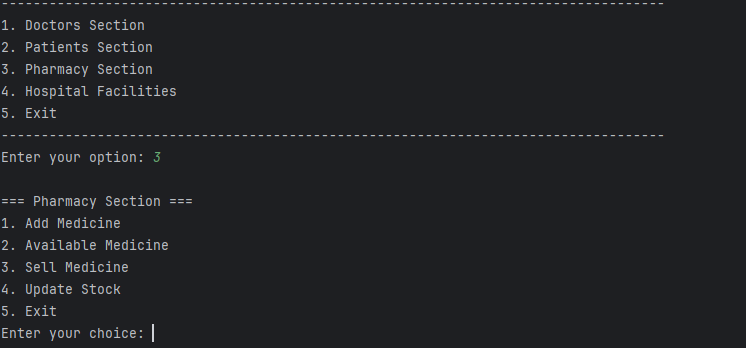
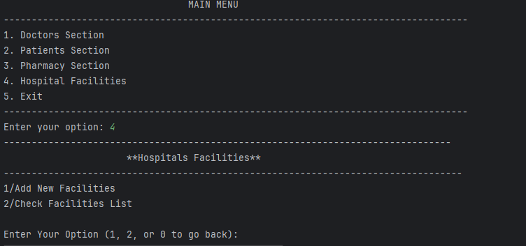

# Hospital and Health Care Management System 🌟

A command-line application developed as part of the Object-Oriented Programming (OOP) Sessional Course of my university(European University of Bangladesh). This project simulates a hospital management system, providing functionalities to manage doctors, patients, pharmacy operations, and hospital facilities using core OOP principles in Java.

---

---

## ✨ Features

### 1. **Doctors Section**
- Add new doctor records.
- View the list of all doctors with details such as ID, name, age, gender, phone, qualifications, timing, and room number.

### 2. **Patients Section**
- Add new patient records.
- View the list of all patients.
- Search for a patient by name or ID.

### 3. **Pharmacy Section**
- Add new medicines.
- Check available stock of medicines.
- Sell medicines and update stock.

### 4. **Hospital Facilities**
- Add new facilities (e.g., MRI, X-ray).
- View a list of hospital facilities with pricing details.

---

## 🛠️ Key Concepts Used

- **Object-Oriented Programming (OOP)**: 
  - Encapsulation
  - Inheritance
  - Polymorphism
  - Abstraction
- **File Handling**: All data is stored in `.txt` files for persistence.
- **Error Handling**: Robust input validation.
- **Menu-Driven CLI Interface**: Easy navigation between different sections.

How to Run 🖥️
   []Pre-Requisites:
 1. JDK (Java Development Kit) installed.
 2. IDE like IntelliJ IDEA, Eclipse, or any text editor with a terminal.
 3. Run Main class  from src file.

 💻 Screenshots
  
  
  
  
   

